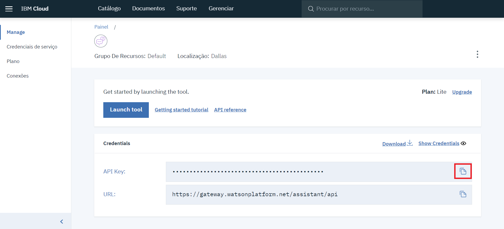
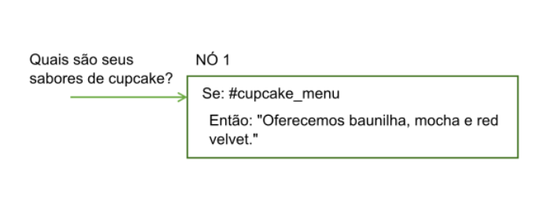
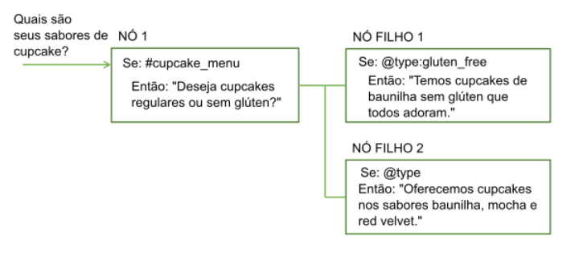
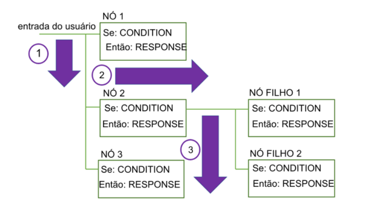

# Watson Assistant

Com o serviço IBM Watson Assistant, você pode construir uma solução que compreende a entrada de língua natural e usa aprendizado de máquina para responder aos clientes de uma maneira que simula uma conversa entre humanos.

Para saber mais acesse [Watson Assistant](https://console.bluemix.net/docs/services/assistant/index.html?locale=en#sobre) e [Watson Assistant API Reference](https://console.bluemix.net/apidocs/assistant)

## Getting Start

### 1. Criar Serviço

Acesse o [Catálogo](https://console.bluemix.net/catalog/) da IBM Cloud e procure por `assistant`.

- Escolha um nome único para seu serviço
- Região e grupo de recursos pode deixar com o valor pre-selecionado
- Selecione o plano desejado: Lite (Free) / Standart / Plus / Premium

### 2. Credenciais

O Watson Assistant ja cria automaticamente para você uma credencial e a disponibiliza na página principal, podendo simplesmente copiar e colar no seu arquivo *.env*.

### 3. Introdução ao Watson Assistant

Acesse o serviço clicando no botão `Launch tool`. Ele te direcionará para o dashboard do Watson Assistant, na página inicial temos vários tutoriais explicando como criar seu chatbot. Temos também duas outras abas:

- Skills: Onde está contido os dados de treinamento e a lógica que permite nosso chatbot a entender e ajudar o usuário. Nelas estão nossas [intenções](#3.2intenções), [entidades](#entidades) e nó de [dialogo](#dialogo).
- Assistants: Onde se agrupa as skills e permite um deploy simples para seu chatbot.

### 3.1 Criando uma skill

Você pode criar uma skill clicando no botão `Create new`. Você terá 3 opções:

#### 3.1.1 Create new Skill

Nessa opção você criará uma skill do zero. Para isso você precisa prover detalhes sobre ela:

- `Name`: não pode tem mais de 100 characteres. Ele é um campo obrigatório.
- `Description`: não pode ter mais de 200 caracteres. Ele é um campo opcional.
- `Language`: A língua que a skill será treinada para entender. O default é inglês.

#### 3.1.2 Use a Sample Skill

- Custumer Care Sample Skill: Irá criar intenções, entidades e um fluxo de diálogo simples para um exemplo de atendimento ao cliente.

#### 3.1.3 Import Skill

Caso você tenha uma skill exportada em formato .json anteriormente, você poderá importá-la ou somente as intenções e entidade ou completamente - com os fluxos de diálogo também.

### 3.2 Intenções

Intenções são propósitos ou objetivos expressos em uma pergunta feita pelo usuário, e cada intenção pode ter vários exemplos de perguntas ou afirmações. Por exemplo: "Como você chama?" ou "Me fala seu nome" tem a mesma intenção só que feitas de forma diferente.

**_Intenções são referenciadas atravers do_ `#`**

#### 3.2.1 Criando Intenções

Basta clicar no botão `Add Intent`.

- Intent Name: é o nome da intenção, ela será usada para ser acessada no diálogo. É um campo obrigatório.
- Description: é uma descrição do que aquela intenção categoriza. É um campo opcional.

Clique em `Create Intent`.

- Add user examples: Todos os exemplos que referenciam aquela intenção

Para saber mais acesse [Intents Doc](https://cloud.ibm.com/docs/services/assistant/intents.html#definindo-inten-es).

### 3.3 Entidades

Entidades representam uma classe de objeto ou um tipo de dados que é relevante. Ao reconhecer as entidades mencionadas na entrada do usuário, o serviço Watson Assistant pode escolher as ações específicas a serem tomadas para cumprir uma intenção. Ou seja, permite com que uma intenção seja mais genérica, cumprindo a função de especificar alguma decisão dentro do diálo. Por exemplo: Bom dia, Boa tarde e Boa noite, são saudações, ao invés de eu criar uma intenção para cada exemplo, eu generalizo na intençao `#saudacao`, que irá conter: Ola, oi, e ai, bom dia, etc. E especifico na entidade `@tipo_saudacao`. Assim, no nó de dialogo eu posso personalizar minha resposta, se o usuário dizer Bom dia, serei capaz de responder Bom dia..., e assim por diante.

Entidades podem ser customizadas ou `System Entities`.

**_Entidades são referenciadas atravers do_ `@`**

#### 3.3.1  System Entities

O serviço Watson Assistant fornece um número de entidades de sistema, que são entidades comuns que você pode usar para qualquer aplicativo. A ativação de uma entidade do sistema torna possível preencher rapidamente sua área de trabalho com dados de treinamento que são comuns a muitos casos de uso.

Entidades do Sistema podem ser usadas para reconhecer uma ampla variedade de valores para os tipos de objetos que eles representam. Por exemplo, a entidade do sistema `@sys-number` corresponde a qualquer valor numérico, incluindo números inteiros, frações decimais ou mesmo números gravados como palavras.

As entidades do sistema são mantidas centralmente, portanto, quaisquer atualizações ficarão disponíveis automaticamente. Não é possível modificar entidades do sistema.

#### 3.3.1.1 Criando Sytem Entities

- Na guia Entidades, clique em Entidades do sistema.
- Navegue pela lista de entidades do sistema para escolher as que são úteis para seu aplicativo.
  - Para consultar informações adicionais sobre uma entidade do sistema, incluindo exemplos de entrada correspondente, clique na entidade na lista.
  - Para obter detalhes sobre as entidades do sistema disponíveis, consulte [Entidades do Sistema](https://cloud.ibm.com/docs/services/assistant/system-entities.html).
- Clique no interruptor de duas posições próximo a uma entidade do sistema para ativá-la ou desativá-la.

#### 3.3.2 Criando Entidades

- Clique em Incluir entidade.
- No campo Nome da entidade, digite um nome descritivo para a entidade.
- O nome da entidade pode conter letras, números, sublinhados e hifens. Por exemplo:
  - @location
  - @menu_item
  - @product
- Selecione Criar entidade.
- No campo `Entity name`, digite o texto de um valor possível para a entidade e pressione a tecla Enter. Um valor de entidade pode ser qualquer sequência de até 64 caracteres de comprimento.
- Depois de inserir um nome do valor, é possível incluir quaisquer sinônimos ou definir padrões específicos para esse valor de entidade selecionando `Synonyms` ou `Patterns` no menu `Tipo`.
- Clique em Incluir valor e repita o processo para incluir mais valores de entidade.

Caso queira entender mais veja [Entity Doc](https://cloud.ibm.com/docs/services/assistant/entities.html#creating-entities)

### 3.3 Diálogo

O diálogo utiliza as intenções e entidades que são identificadas na mensagem do usuário, além de contexto, para interagir com o usuário e finalmente fornecer uma resposta útil e empática.

#### 3.3.1 Nós de Diálogo

Cada nó de diálogo contém, no mínimo, uma condição e uma resposta.

- **`Condição`**: Especifica as informações que devem estar presentes na mensagem do usuário para que esse nó no diálogo seja acionado. As informações podem ser uma intenção específica, um valor de entidade ou um valor variável de contexto. Consulte [Condições](https://cloud.ibm.com/docs/services/assistant/dialog-runtime.html#conditions) para obter informações adicionais.
- **`Resposta`**: A resposta que o chatbot dará quando forem reconhecidas as condições daquele nó. Consulte [Respostas](https://cloud.ibm.com/docs/services/assistant/dialog-overview.html#responses) para obter informações adicionais.

Um nó único com uma condição e resposta pode manipular perguntas simples do usuário. Porém, mais frequentemente, os usuários têm perguntas mais sofisticadas ou desejam ajuda com tarefas mais complexas. É possível incluir nós-filhos que pedem para o usuário fornecer qualquer informação adicional que o serviço necessite.

#### 3.3.2 Fluxo de Diálogo

O diálogo que você cria é processado pelo serviço do primeiro nó para o último.
À medida que ele viajar pelos nós, se o serviço localizar uma condição que foi atendida, ele acionará aquele nó. Em seguida, ele se move ao longo do nó acionado para verificar a entrada do usuário com relação a quaisquer condições do nó-filho. Conforme verifica os nós-filhos, ele se move novamente a partir do primeiro nó-filho para o último.

Se nenhuma das condições é avaliada como true, a resposta do último nó na árvore, que geralmente tem uma condição especial anything_else que sempre é avaliada como true, é retornada.

#### 3.3.3 Condições

- Variável de [Contexto](https://cloud.ibm.com/docs/services/assistant/dialog-runtime.html#context): Use a sintaxe `$variable_name:value` ou `$variable_name == 'value'`. Por exemplo, `$city:Boston` verifica se a variável de contexto `$city` contém o valor `Boston`. Se for assim, o nó ou a resposta será processada.
- [Entidades](https://cloud.ibm.com/docs/services/assistant/entities.html):  O nó é usado quando qualquer valor ou sinônimo para a entidade é reconhecido na entrada do usuário. Use a sintaxe `@entity_name`. Por exemplo, `@city` verifica se algum dos nomes de cidades que são definidos para a entidade `@city` foram detectados na entrada do usuário. Se for assim, o nó ou a resposta será processada.
  - Valor da Entidade: o nó é usado se o valor da entidade é detectado na entrada do usuário. Use a sintaxe `@entity_name:value` e especifique um valor definido para a entidade, não um sinônimo. Por exemplo: `@city:Boston` verifica se o nome da cidade específica, `Boston`, foi detectado na entrada do usuário.
- [Intenção](https://cloud.ibm.com/docs/services/assistant/intents.html): a condição mais simples é uma única intenção. O nó é usado se a entrada do usuário é mapeada para essa intenção. Use a sintaxe `#intent_name.` Por exemplo, `#weather` verifica se a intenção detectada na entrada do usuário é weather. Em caso afirmativo, o nó é processado.
- Condição especial: condições que são fornecidas com o serviço que você pode usar para executar funções de diálogo comuns:

| Sintaxe da Condição | Descrição                                                                                                                                                                                                                                                                                                                                                                                                                                                   |
| ------------------- | ----------------------------------------------------------------------------------------------------------------------------------------------------------------------------------------------------------------------------------------------------------------------------------------------------------------------------------------------------------------------------------------------------------------------------------------------------------- |
| anything_else       | É possível usar essa condição no final de um diálogo, para ser processada quando a entrada do usuário não corresponde a nenhum outro nó de diálogo. O nó **Qualquer outra coisa** é acionado por essa condição.                                                                                                                                                                                                                                             |
| conversation_start  | Como **welcome**, essa condição é avaliada como true durante a primeira rodada do diálogo. Diferentemente de **welcome**, é true se a solicitação inicial do aplicativo contém entrada do usuário ou não. Um nó com a condição **conversation_start** pode ser usado para inicializar variáveis de contexto ou executar outras tarefas no início do diálogo.                                                                                                |
| false               | Essa condição é sempre avaliada como false. Você pode usar isso no início de uma ramificação que está em desenvolvimento, para evitar que seja usada ou como a condição para um nó que fornece uma função comum e é usada somente como o destino de uma ação **Ir para**.                                                                                                                                                                                   |
| irrelevant          | Essa condição será avaliada como true se a entrada do usuário for determinada como irrelevante pelo serviço Watson Assistant.                                                                                                                                                                                                                                                                                                                               |
| true                | Essa condição é sempre avaliada como true. É possível usá-la no final de uma lista de nós ou respostas para capturar quaisquer respostas que não correspondam a nenhuma das condições anteriores.                                                                                                                                                                                                                                                           |
| welcome             | Essa condição é avaliada como true durante a primeira rodada do diálogo (quando a conversa começa), apenas se a solicitação inicial do aplicativo não contém nenhuma entrada do usuário. Ela é avaliada como false em todas as rodadas de diálogo subsequentes. O nó Welcome é acionado por essa condição. Geralmente, um nó com essa condição é usado para saudar o usuário, por exemplo, para exibir uma mensagem como Welcome to our Pizza ordering app. |
